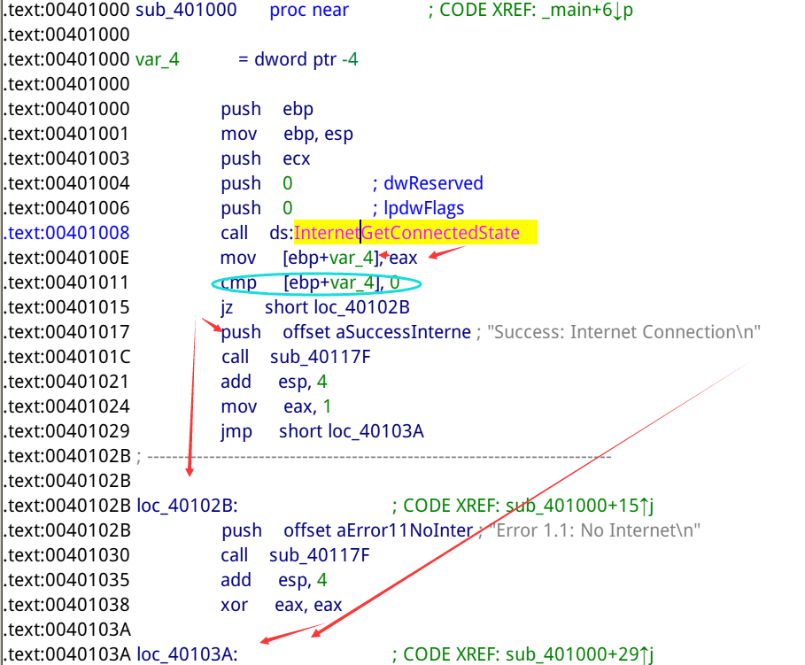
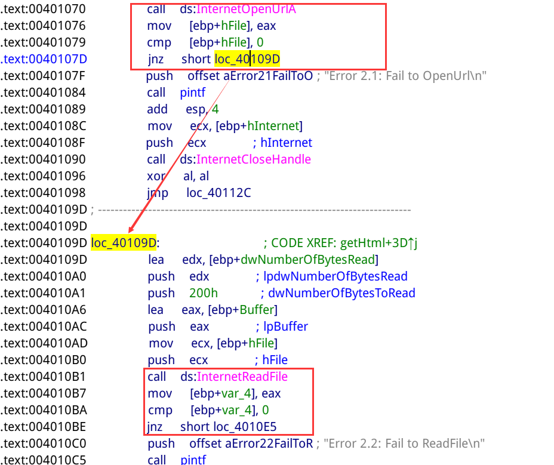
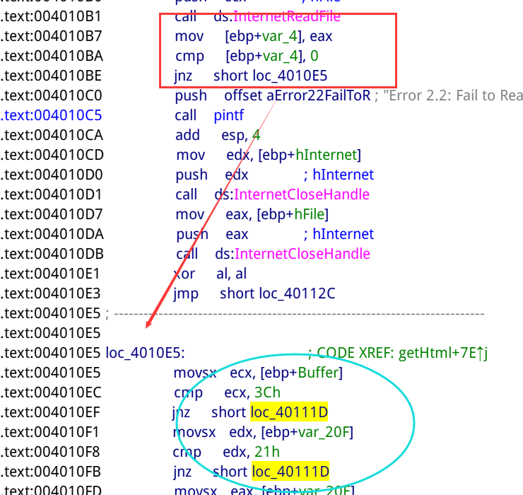
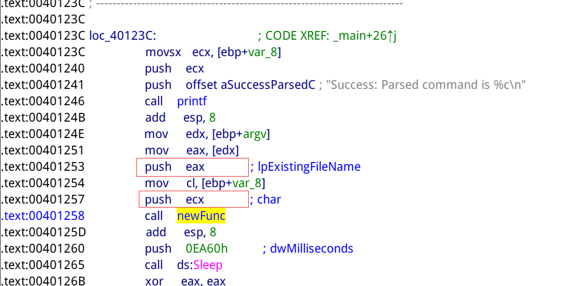
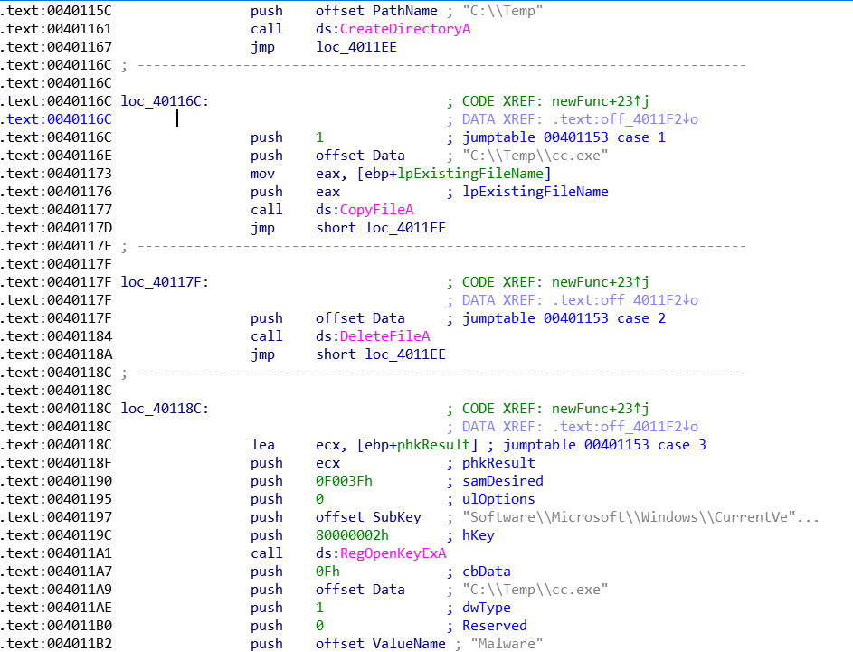

# Lab6

## Lab 6-1

1. **What is the major code construct found in the only subroutine called by main?**

   

   在调用InternetGetConnectedState(0,0)后，是很明显的cmp；jz结构，所以此函数的主要结构是条件判断结构

2. **What is the subroutine located at 0x40105F?**

    对sub_40105f函数进行分析，其中调用了两个特殊的系统API:\_\_stbuf, \_\_ftbuf。其中stbuf是对一块缓冲区进行初始化，以便进行输出或转化；ftbuf 则是将一个字符串转到标准输出流。

   

   对此函数进行调试，可以发现在调用了ftbuf之后，确实输出了0x40105f函数的参数。基本可以确定此函数是进行输出类的函数，如puts， printf等。进一步搜索后得知，stbuf和ftbuf是printf类函数的特征，所以可以确定函数sub_40105f是printf函数

3. **What is the purpose of this program?**

    在main函数中仅调用了sub_401000函数，在sub_401000函数中输出了网络连接状况。

   所以此程序的功能是检测网络连接并在交互窗口中进行输出

## Lab 6-2

1. **What operation does the first subroutine called by main perform?**

   主函数首先调用了sub_401000()函数。

   

   函数中调用了InternetGetConnectedState，将返回值与0进行比较，并分支对不同的字符串调用sub_40117f函数。可以确定此函数进行网络状况的检测

2. **What is the subroutine located at 0x40117F?**

   sub_40117f的结构与Lab06-1中sub_40105f函数完全相同，所以sub_40117f函数是printf函数

3. **What does the second subroutine called by main do？**

   使用IE作为网络代理，访问http://www.practicalmalwareanalysis.com/cc.htm网页，读取网页内容，并返回网页的文本内容。

4. **What type of code construct is used in this subroutine?**

   使用了三层嵌套条件判断结构

   

   

5. **Are there any network-based indicators for this program?t**

   - 使用IE浏览器作为网络代理
   - 访问http://www.practicalmalwareanalysis.com/cc.htm网页
   - 读取网页的文本内容，并最长返回0x200长度的文本内容

6. **What is the purpose of this malware?**

   此病毒的目的是检测网络连接情况后，如果连通则访问http://www.practicalmalwareanalysis.com/cc.htm网页并下载网页文本内容

## Lab 6-3

1. **Compare the calls in main to Lab 6-2’s main method. What is the new function called from main?**

   Lab6-3程序中，与Lab6-2相比，除了调用检查网络连接、获取网页文本内容、输出获取结果之外，还多调用了sub_401130函数

2. **What parameters does this new function take?**

   

   此函数的两个参数分别是从目标网页读取的文本和运行程序的参数，应该是代表存在的文件名

3. **What major code construct does this function contain?**

   使用了switch分支结构

   

   并且采用了jump table的方式进行跳转，根据switch的值，直接获得跳转的地址而避免了多次的cmp

4. **What can this function do?**

   

   此函数能够根据从网页读取的内容，分别进行以下操作

   - 创建C:\\Temp文件夹
   - 将程序参数文件复制到C:\\Temp中并命名cc.exe
   - 删除C:\\Temp\\cc.exe文件
   - 创建或修改注册表键值

5. **Are there any host-based indicators for this malware?**

   - 创建C:\\Temp文件夹
   - 将参数文件复制到C:\\Temp文件夹中并命名cc.exe
   - 能够删除C:\\Temp\\cc.exe文件
   - 创建Software\Microsoft\Windows\CurrentVersion\Run键并修改值

6. **What is the purpose of this malware?**

   此病毒的目的是远程连接网络，根据读取的网页文本内容进行操作，实现文件复制、删除或修改注册表键值的单个操作。

## Lab 6-4

1. **What is the difference between the calls made from the main method in Labs 6-3 and 6-4?**

   

   与Lab6-3相比，Lab循环调用getHtml (sub_401040)和changeReg(sub_401150)函数，能够实现多次读取命令并执行不同的操作

2. **What new code construct has been added to main?**

   如上题图，main函数中增加了for循环结构

3. **What is the difference between this lab’s parse HTML function and those of the previous labs?**

   

   与之前的函数相比，Lab4中的getHtml(sub_401040)函数有一个参数，是循环变量i，使用的网络代理受传入的参数决定。

4. **How long will this program run? (Assume that it is connected to the Internet.**

   程序将运行1440*0xea60毫秒，即24小时

5. **Are there any new network-based indicators for this malware?**

   - 使用Internet Explorer 7.50/pma%d代理，%d是循环的次数。
   - 循环访问http://www.practicalmalwareanalysis.com/cc.htm网页
   - 读取网页的文本内容，并最长返回0x200长度的文本内容

6. **What is the purpose of this malware?**

   此病毒的目的是检测网络连接后循环访问http://www.practicalmalwareanalysis.com/cc.htm网页并获取网页文本内容，根据获取的文本内容作为指令代号，多次执行特定的创建目录、复制删除文件和修改注册表键值的操作，实现远程控制的功能。

   

