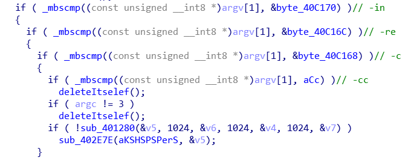
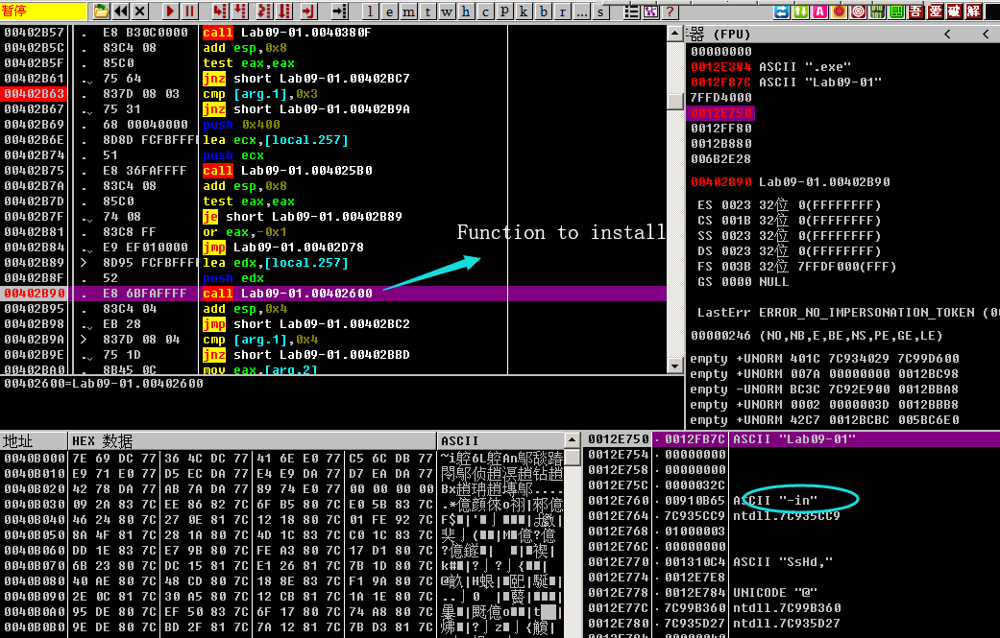
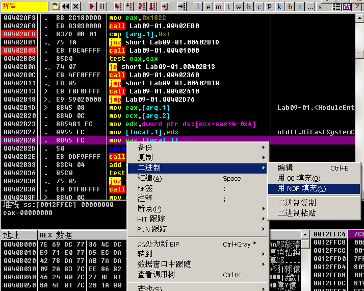
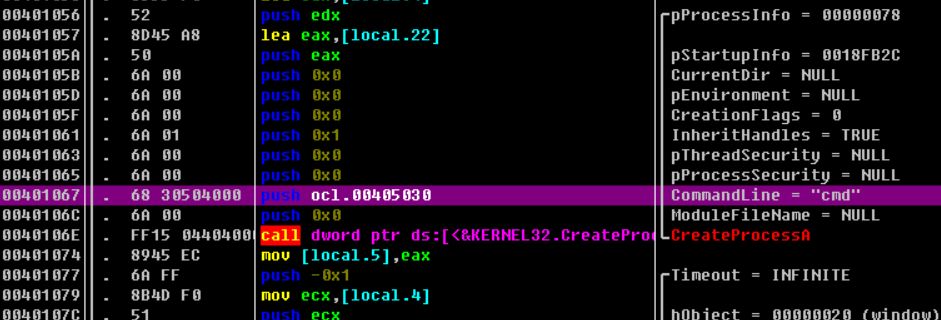
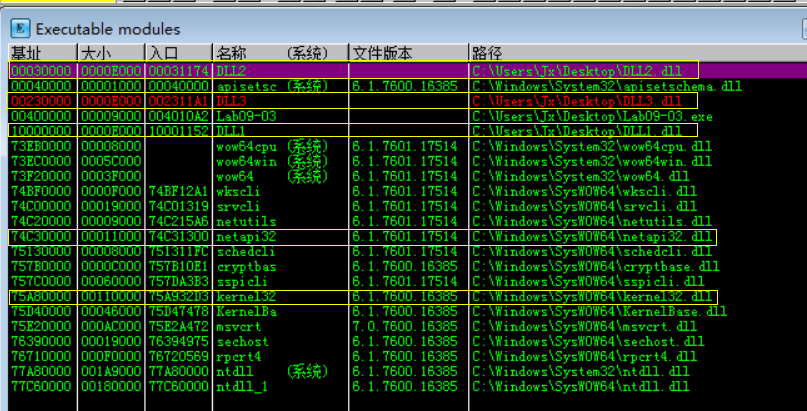
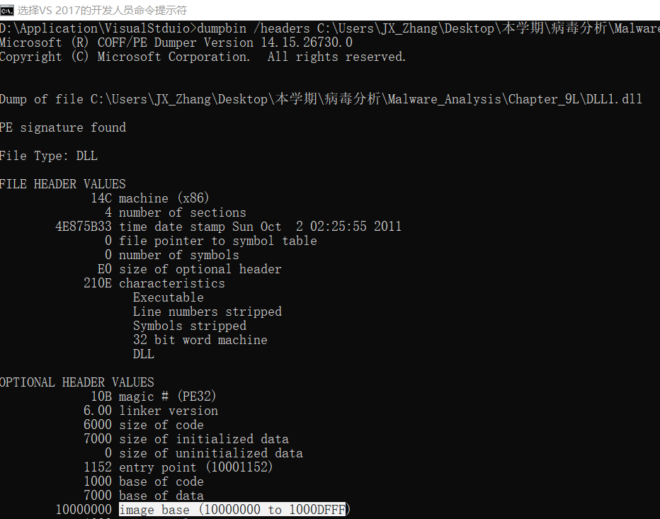
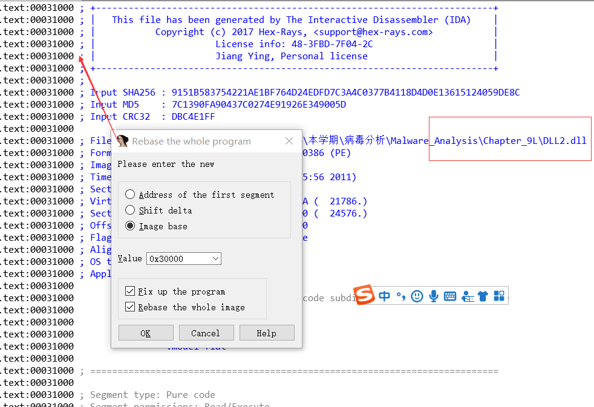

# 上机实验3

## Lab 9-1
Analyze the malware found in the file Lab09-01.exe using OllyDbg and IDA Pro to answer the following questions. This malware was initially analyzed in the Chapter 3 labs using basic static and dynamic analysis techniques.
Questions

1. **How can you get this malware to install itself?**

   首先根据程序启动参数判断,对第一个参数有四种情况的判断，分别是-in，-re， -c和-cc

   

   可以猜测，-in对应的功能即为程序的安装(install)功能，通过分析sub_402600函数，其中存在大量的对windows Service进行操作的函数，基本可以确定该函数为程序的安装函数。

   要执行到sub_402600函数，需要满足：

   - argv[1] == '-in'
   - 通过sub_402510函数对argv[argc-1]即最后一个参数的检查
     - strlen(argv[-1]) == 4
     - argv[-1] [0] == 'a'
     - argv[-1] [1] == 'b'
     - argv[-1] [2] == 'c'
     - argv[-1] [3] == 'd'

   根据此条件设置参数进行调试，可以看到调用sub_402510后返回值eax为1， 即使用 -in abcd参数就能够通过sub_402510函数的检查

   

   并在0x402b90处调用install函数，实现安装功能

   

   所以想要进行安装的启动命令应该是**./lab09-1.exe -in abcd**

2. **What are the command-line options for this program? What is the password requirement?**

   命令选项有

   - -in
   - -re
   - -c
   - -cc

   需要的密码是abcd，作为最后一个参数

3. **How can you use OllyDbg to permanently patch this malware, so that it doesn’t require the special command-line   password?**

   按照下图所示重复进行即可删掉验证密码部分, 直接把0x402B2A到0x402b3a所有指令，即调用检查函数和跳转的指令改为nop，即可删除检查部分。或者将0x402b38处的jnz指令改为jz指令也能使用任意密码通过验证

   

4. **What are the host-based indicators of this malware?**

   - 在存在多次检查，检查失败后会获取自身路径并进行自我删除。
   - 能够创建服务，并将自身二进制文件伪装成为windows 服务实现持续性。
   - 会进行文件的创建和文件读写操作
   - 会获取设备制造商信息及已安装的代码页的信息
   - 会向注册表HKEY_LOCAL_MACHINE\\SOFTWARE\Microsoft \XPS 中创建键，并进行注册表的读写

5. **What are the different actions this malware can be instructed to take via the network?**

   程序安装后进行无参数启动，在sub_402360函数内调用sub_402020函数，可以根据接收的命令，执行以下操作：

   - sleep：使系统等待
   - upload：创建一个文件并写入接收到的数据
   - download：将本地的一个文件发送给远程服务器
   - cmd：popen执行命令
   - nothing：什么都不做

6. **Are there any useful network-based signatures for this malware?**

   病毒先使用-c参数写注册表后，无参数启动，能够执行有害代码。会http://www.practicalmalwareanalysis.com网站进行多次交互，并返回命令指导本地病毒的行为。

## Lab 9-2
Analyze the malware found in the file Lab09-02.exe using OllyDbg to answer the following questions.
Questions

1. **What strings do you see statically in the binary?**

   使用strings命令获得以下结果(去除乱码及无意义字符)

   ```
   $ strings lab09-02.exe 
   !This program cannot be run in DOS mode.
   E;Rich!
   .text
   `.rdata
   @.data
   ···
   runtime error 
   TLOSS error
   SING error
   DOMAIN error
   R6028
   - unable to initialize heap
   R6027
   - not enough space for lowio initialization
   R6026
   - not enough space for stdio initialization
   R6025
   - pure virtual function call
   R6024
   - not enough space for _onexit/atexit table
   R6019
   - unable to open console device
   R6018
   - unexpected heap error
   R6017
   - unexpected multithread lock error
   R6016
   - not enough space for thread data
   abnormal program termination
   R6009
   - not enough space for environment
   R6008
   - not enough space for arguments
   R6002
   - floating point not loaded
   Microsoft Visual C++ Runtime Library
   Runtime Error!
   Program: 
   <program name unknown>
   GetLastActivePopup
   GetActiveWindow
   MessageBoxA
   user32.dll
   WaitForSingleObject
   CreateProcessA
   Sleep
   GetModuleFileNameA
   KERNEL32.dll
   WSASocketA
   WS2_32.dll
   GetCommandLineA
   GetVersion
   ExitProcess
   TerminateProcess
   GetCurrentProcess
   UnhandledExceptionFilter
   FreeEnvironmentStringsA
   FreeEnvironmentStringsW
   WideCharToMultiByte
   GetEnvironmentStrings
   GetEnvironmentStringsW
   SetHandleCount
   GetStdHandle
   GetFileType
   GetStartupInfoA
   HeapDestroy
   HeapCreate
   VirtualFree
   HeapFree
   RtlUnwind
   WriteFile
   HeapAlloc
   GetCPInfo
   GetACP
   GetOEMCP
   VirtualAlloc
   HeapReAlloc
   GetProcAddress
   LoadLibraryA
   MultiByteToWideChar
   LCMapStringA
   LCMapStringW
   GetStringTypeA
   GetStringTypeW
   ```

   在运行过程中，从ollydbg中进行字符串搜索，额外出现而来当前程序的运行路径和cmd字符串。

   

2. What happens when you run this binary?**

    运行程序后，首先获取当前程序运行路径，将文件名与ocl.exe比较后，比较失败主函数直接返回，程序退出 

3. **How can you get this sample to run its malicious payload?**

     将程序重命名为ocl.exe，可以通过程序对文件名的检查，从而运行后面的有害代码。

4. **What is happening at 0x00401133?**

     0x401133处为栈变量赋值, 将ebp-0x1b0处的变量当做字符串，为每个byte分别赋值，形成字符串‘1qaz2wsx3edc\0ocl.exe’，前12字节是123加上键盘上左三列。

     

5. **What arguments are being passed to subroutine 0x00401089?**

    传入的参数分别是'1qaz2wsx3edc'字符串的指针和全局变量asc_405034拷贝到栈上变量的指针

6. **What domain name does this malware use?**

     根据0x4012cc处代码call gethostbyname,可以判断在0x4012cb处传入的eax值即为所求域名，即0x401089函数的返回值。所以使用的域名是http://www.practicalmalwareanalysis.com

     

7. **What encoding routine is being used to obfuscate the domain name?**

     0x401089函数即为解析域名的函数，分析函数内容可得，域名为1qaz2wsx3edc字符串循环与asc_405034值进行异或得到，所以采用了异或的混淆方式。

8. **What is the significance of the CreateProcessA call at 0x0040106E?**

    在进程中通过createprocessA函数创建子进程，运行cmd程序，同时通过startupInfo参数，将cmd程序的标准输入、标注输出、标准错误全部设置为在主函数中建立的socket，从而实现了一个远程shell，可以远程执行任意命令并获得命令的返回信息。

## Lab 9-3
Analyze the malware found in the file Lab09-03.exe using OllyDbg and IDA Pro. This malware loads three included DLLs (DLL1.dll, DLL2.dll, and DLL3.dll) that are all built to request the same memory load location. Therefore, when
viewing these DLLs in OllyDbg versus IDA Pro, code may appear at different memory locations. The purpose of this lab is to make you comfortable with finding the correct location of code within IDA Pro when you are looking at code in OllyDbg.
Questions

1. **What DLLs are imported by Lab09-03.exe?**

   在ollydbg中查看可执行模块，可以查看当前进程中所有模块，其中可以看到，本程序引用的dll有：kernel32.dll, netapi32.dll, DLL1.dll, DLL2.dll, DLL3.dll，其中DLL3.dll是程序在运行过程中载入的，其余的模块为kernel32和netapi32模块内部引用所致。

   通过对LoadLibraryA函数的交叉引用分析，程序在__crtMessageBoxA函数中也存在对user32.dll的动态导入，应该是在弹出消息窗口的作用。

   

2. **What is the base address requested by DLL1.dll, DLL2.dll, and DLL3.dll?**

   使用vs2017工具dumpbin分析dll的headers信息，可以得到image base即为默认的加载基址为0x10000000

   

   相同的步骤分别对DLL2和DLL3进行分析，可以得到他们的默认请求加载基址都是0x10000000

3. **When you use OllyDbg to debug Lab09-03.exe, what is the assigned based address for: DLL1.dll, DLL2.dll, and DLL3.dll?**

   由第一题中在调试过程中查看可执行模块，可以得到在该次调试过程中每个模块的加载基址，其中

   ​	DLL1.dll的加载基址为0x10000000

   ​	DLL2.dll的加载基址为0x30000

   ​	DLL3.dll的加载基址为0x230000

   

4. **When Lab09-03.exe calls an import function from DLL1.dll, what does this import function do?**

   Lab09-03.exe中调用的来自DLL1的导入函数是DLL1Print， 在DLL1Print函数中调用的sub_10001038函数经过分析是printf函数，他的第一个参数是格式化字符串，第二个参数dword_10008030经过交叉引用查询是在DLLMain函数中赋值为GetCurrentProcessId函数的返回值。即DLL1Print函数打印了装  q载DLL1.dll的进程的pid。

   

   使用ollydbg的loaddll功能对DLL1进行调试，得到为dword_10008030赋的值为0x56c，在进程列表中进行查找，确实存在加载dll的进程

   

5. **When Lab09-03.exe calls WriteFile, what is the filename it writes to?**

   Lab09-03.exe程序中调用WriteFile函数的第一个参数是目标文件的句柄

   

   向上回溯可得，该句柄是DLL2的导出函数DLL2ReturnJ函数的返回值。对DLL2进行分析可知，DLL2ReturnJ函数返回的是DllMain函数中CreateFileA函数的结果。

   

   启动LOADDLL对DLL2进行调试，可以得到CreateFileA函数创建的文件名为temp.txt

6. **When Lab09-03.exe creates a job using NetScheduleJobAdd, where does it get the data for the second parameter?**

   先使用GetProcAddress函数获取DLL3的导入函数DLL3GetStructure函数地址给[local.4]变量，然后以[local.7]为参数调用[local.4]，在此过程中[local.7]获取数据，成为调用NetScheduleJobAdd函数的第二个参数

   

7. **While running or debugging the program, you will see that it prints out three pieces of mystery data. What are the following: DLL 1 mystery data 1, DLL 2 mystery data 2, and DLL 3 mystery data 3?**

   - DLL1 mystery data 1为加载DLL1.dll进程的pid  (Question 4)

   - DLL2 mystery data 2为DllMain函数中创建temp.txt文件返回的句柄  (Question 5)

   - DLL3 mystery data 3为字符串*ping www.malwareanalysisbook.com*转化为宽字节数据的地址

     

     运行Lab09-03.exe, 得到的结果为0x22b0c0， 与调试过程中宽字节数据的偏移相符合。

8. **How can you load DLL2.dll into IDA Pro so that it matches the load address used by OllyDbg**

   在ida中加载DLL2.dll后选择edit -> segments -> Rebase program

   选择image base并指定加载基址即可对整个PE文件进行rebase

   